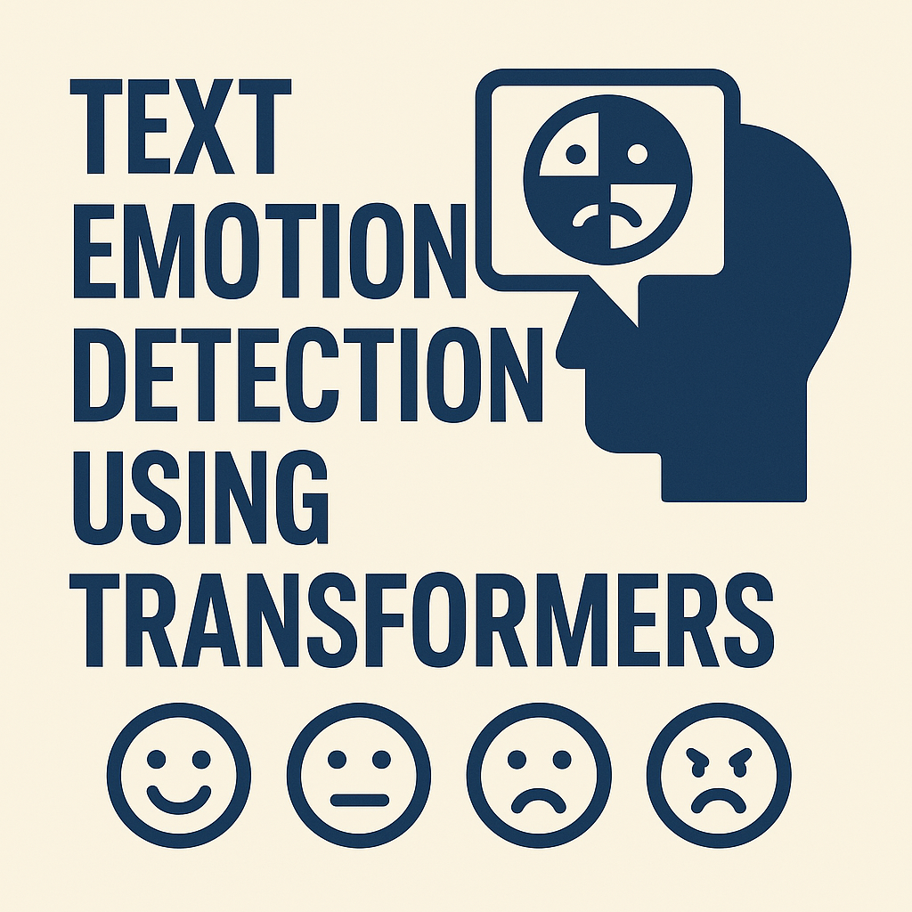
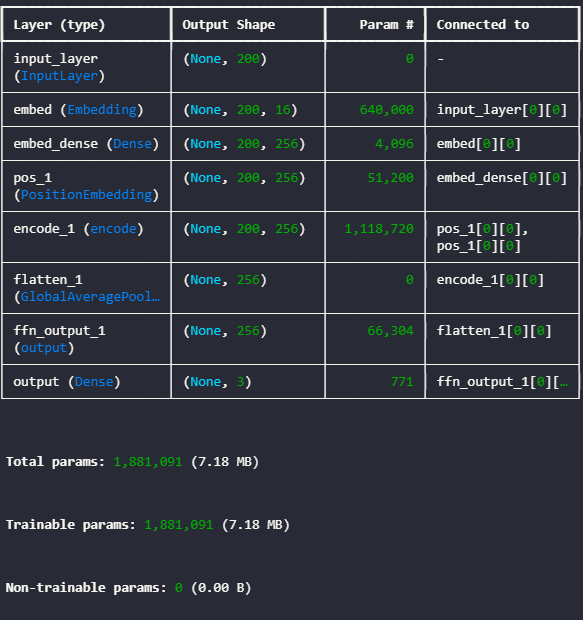
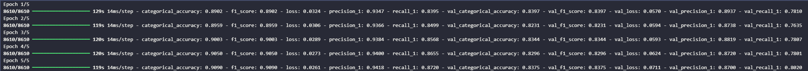
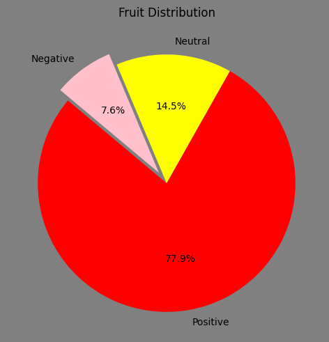
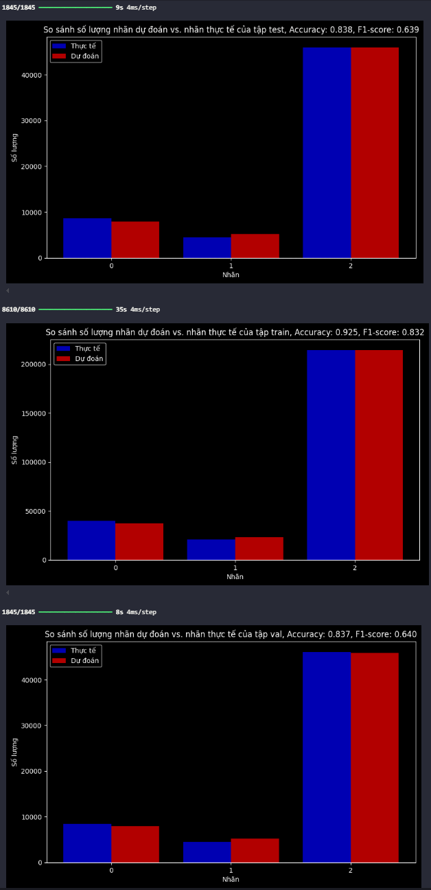

## XÂY DỰNG MÔ HÌNH NHẬN DIỆN TÉ NGÃ ĐỘT QUỴ VỚI YOLO V8 BẢNG CẢI TIẾNG

## Lời mở đầu 
-Trong thời đại công nghệ số, việc phân tích và hiểu được cảm xúc của con người thông qua văn bản ngày càng trở nên quan trọng. Từ các ứng dụng chăm sóc khách hàng, mạng xã hội đến các hệ thống hỗ trợ tâm lý, khả năng tự động nhận diện cảm xúc trong văn bản giúp cải thiện trải nghiệm người dùng, hỗ trợ ra quyết định và nâng cao hiệu suất hoạt động của nhiều lĩnh vực khác nhau.

-Dự án "Dự đoán cảm xúc văn bản sử dụng Transformer" ra đời nhằm khai thác sức mạnh của mô hình Transformer trong việc xử lý ngôn ngữ tự nhiên (NLP). Transformer đã chứng minh được hiệu quả vượt trội trong nhiều bài toán NLP nhờ vào khả năng học ngữ cảnh và mối quan hệ giữa các từ trong câu. Với kiến trúc này, hệ thống có thể phân tích nội dung văn bản và dự đoán chính xác cảm xúc ẩn chứa trong đó, từ vui vẻ, buồn bã, giận dữ đến sợ hãi, ngạc nhiên và nhiều trạng thái cảm xúc khác.

-Mục tiêu của dự án là xây dựng một mô hình hiệu quả, có thể áp dụng trong thực tế để phân loại cảm xúc văn bản với độ chính xác cao. Để đạt được điều này, dự án sẽ sử dụng các tập dữ liệu lớn, áp dụng kỹ thuật tiền xử lý văn bản phù hợp, và tinh chỉnh mô hình Transformer nhằm tối ưu hóa kết quả dự đoán.

-Với tiềm năng ứng dụng rộng rãi, hệ thống dự đoán cảm xúc văn bản không chỉ mang lại lợi ích cho doanh nghiệp trong việc hiểu khách hàng, mà còn hỗ trợ trong các lĩnh vực như giáo dục, y tế và truyền thông. Dự án này là một bước tiến quan trọng trong việc khai thác trí tuệ nhân tạo để mang lại giá trị thiết thực cho cuộc sống con người.

## Thành viên thực hiện 
- Nguyễn Lê Quốc Bảo - tham gia đóng góp 100% (bản thân) (Cài đặt huấn luyện mô hình, code xử lý data, tìm kiếm nguồn data, code demo cho mô hình sau huấn luyện, viết báo cáo).

## Các vị trí trong dự án
- Ba (phân tích mô hình, tìm kiếm mô hình, tìm kiếm data, viết báo cáo).
- Dev (xây dựng, training, hiệu chỉnh mô hình)
- Tester (kiểm thử mô hình)
- leader (Điều hành, quản lý dự án)

## Vị trí của bản thân
- Dev, leader, Ba, Tester, Leader

## Mô hình sử dụng và lĩnh vực 
- Lõi chính là lớp encode của tranformer
- Lĩnh vực xử lý ngôn ngữ tự nhiên

## Các thư viện và ngôn ngữ sử dụng trong dự án
- Ngôn ngữ Python
- Opencv
- Numpy
- Tensorflow
- Sklean
- Pandas

## Các công cụ hỗ trợ 
- Jupyter lab (trainning).
- IDE: vscode(tạo dữ liệu mẫu, xử lý dữ liệu, kiểm tra mô hình, xây dựng mô hình).

## Kiến trúc mô hình

## Loss sau 5 epochs

## Phân bố nhãn

## Phân bố dự đoán

## Video demo cho dự án 
- (chưa cập nhật)
<!--  -->

## Tài liệu
- (chưa cập nhật)
<!-- - [Báo cáo chi tiết dự án](report/Đồ%20án%20nhóm.doc)
- [Báo cáo tóm tắt dự án](report/Tóm%20Tắt.docx) -->

## Link data và mô hình (file trọng số).
- [Data](https://drive.google.com/drive/folders/1s5sht9o0ZUrrSLE4D1-0kpNKpggCCsRU?usp=sharing)
- [Trọng số mô hình (dùng tf để load)(Chưa cập nhật )]

